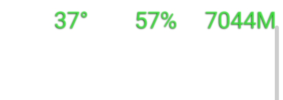
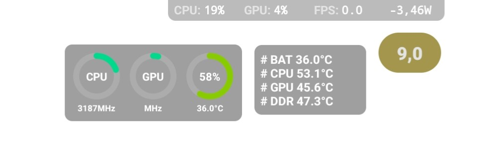

# Recommended apps for your REDMAGIC phone
> Apps that will greatly improve your user experience on your REDMAGIC phone

## Useful apps to assist in gaming
> Useful apps for gaming

### Status bar mini:

Overlay for Battery temperature, percentage and ram usage

[Download](https://status-bar-mini.uptodown.com/android){: .btn .btn-blue }

### Scene7:

Overlays for temperatures, usage and many system information

[Download](https://vtools.omarea.com/){: .btn .btn-blue }

> ##### WARNING
> Scene requires: [Shizuku](https://play.google.com/store/apps/details?id=moe.shizuku.privileged.api) or a computer with ADB access.
{: .block-warning }

### Cpu throttling test
Check system stability under full load

[Download](https://apkpure.com/cpu-throttling-test/skynet.cputhrottlingtest){: .btn .btn-blue }

### Devcheck
Check many device info

[Download](https://play.google.com/store/apps/details?id=flar2.devcheck){: .btn .btn-blue }

## Official REDMAGIC APPS
> Official apps made by REDMAGIC 

### OS6 REDMAGIC gallery 
[Installation guide](guides/GetOldGallery.html){: .btn .btn-green }

> ##### WARNING
> Might not work properly on the REDMAGIC 9Pro
{: .block-warning }

[Download APK](https://github.com/TheRealCrazyfuy/RedmagicOSTricks/raw/main/oldgallery.apk){: .btn .btn-blue }

### Separated sounds channels - Multi sounds app (Only OS9.0 tested)
For REDMAGIC 9PRO:
[Download APK](https://github.com/TheRealCrazyfuy/RedmagicOSTricks/raw/main/APKs/Multi-app_sounds-9pro.apk){: .btn .btn-blue }

For REDMAGIC 8PRO:
[Download APK](https://github.com/TheRealCrazyfuy/RedmagicOSTricks/raw/main/APKs/Multi-app_sounds-8pro.apk){: .btn .btn-blue }

> ##### TIP
> After installation go to Settings > Sound & vibration and you will find the multi sounds settings
{: .block-tip }

### China weather app
Chinese version of the weather app from CN REDMAGIC OS 9, it has more widgets than international version and it should work outside China.

[Download APK](https://github.com/TheRealCrazyfuy/RedmagicOSTricks/releases/download/OS9.0-weather/Weather.apk){: .btn .btn-blue }
## Other apps
> Apps that I found interesting to have but aren't really needed 

### Wallpaper engine
Synchronize your phone's wallpaper with your PC, you will need to have a Windows PC with Wallpaper Engine installed (Paid)

[Download](https://play.google.com/store/apps/details?id=io.wallpaperengine.weclient){: .btn .btn-blue }

### PC games emulators 
You can run many PC games with these emulators

[Horizon](https://github.com/HorizonEmuTeam/Horizon-Emu){: .btn .btn-blue }

[Mobox](https://github.com/olegos2/mobox){: .btn .btn-blue }

### Discord rich presence for Android
Your friends will know what games you're playing in your phone, open source 

[Kizzy](https://github.com/dead8309/Kizzy){: .btn .btn-blue }

### Breezy weather
Open source weather app

[Download](https://github.com/breezy-weather/breezy-weather){: .btn .btn-blue }

### Open source gallery app:
[Gallery](https://github.com/IacobIonut01/Gallery){: .btn .btn-blue }