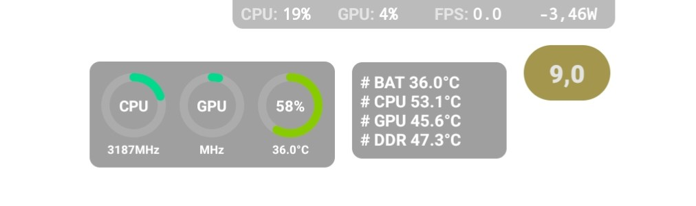

# Monitoring apps
> Monitor your system's performance seamlessly while gaming. With these apps, you can access real-time overlays displaying critical metrics such as temperature, RAM usage, battery status, and more—keeping you in control without interrupting your gameplay.

## Status bar mini:
Light and easy to use app to have an overlay for Battery temperature, percentage and ram usage

[Download](https://status-bar-mini.uptodown.com/android){: .btn .btn-blue }

## Scene7:
Overlays for temperatures, usage and many system information

[Download](https://vtools.omarea.com/){: .btn .btn-blue }

> ##### WARNING
> Scene requires: [Shizuku](https://play.google.com/store/apps/details?id=moe.shizuku.privileged.api) or a computer with ADB access.
{: .block-warning }

## Cpu throttling test
Check system stability under full load

[Download](https://apkpure.com/cpu-throttling-test/skynet.cputhrottlingtest){: .btn .btn-blue }

## Devcheck
Check many device info

[Download](https://play.google.com/store/apps/details?id=flar2.devcheck){: .btn .btn-blue }