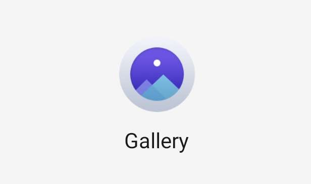

## How to get the old REDMAGIC gallery on newer software versions
In this tutorial we will be installing the old REDMAGIC gallery that was available until OS6, in more modern OS versions

You will need:
- REDMAGIC phone

### 1. Download the apk
You can download the old Gallery apk from [here](https://github.com/TheRealCrazyfuy/RedmagicOSTricks/raw/main/oldgallery.apk)

### 2. Install the apk
- Open the Files app and go to downloads
- Find the oldgallery.apk file and press on it
  
  - If it's the first time you manually install an apk you might see a security message blocking it, don't worry, just press on the `settings` option and allow the permission
- Once the app is installed you can open it, it will ask for images and files permissions, you need to allow everything for proper functionality.

## Known issues
- If the images aren't showing you need to long press on the app icon and select `app info`, then go to `permissions` and allow everything there
- Some REDMAGIC 9 pro users reported the Gallery app not working properly, we tried it on a REDMAGIC 9 pro and it's working for us, needs more investigation.
