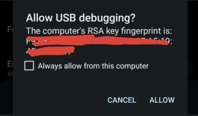
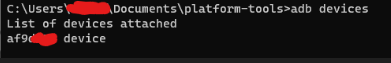

## Battery percentage inside the icon
In this tutorial we will be moving our battery percentage inside the battery icon, this feature was added in OS8.0 but we can enable it in older software versions too. This was tested in OS6.0 but it could work on previous versions too.
You will need:

-Redmagic phone, of course

-Computer

### 1. Enabling USB debugging 
- Unlock your phone and enter the settings app, go to `About phone` and press 7 times the `build number`, a message will appear at the bottom telling us that we are a developer.
- Go back and enter `Advanced settings`, you will see a new option called `Developer options`, enter it
- If you scroll a little you will see a `USB debugging` option that we need to enable if it isn't already

### 2. Downloading Minimal ADB
Now we need to download our ADB program on our computer. These steps are made for Windows, if you have any linux distro or MacOS you will need to find for yourself how to install ADB there
- Download [Minimal ADB](https://androidfilehost.com/?fid=962187416754459552) on your computer
- Extract it anywhere
- Enter the extracted folder and open "cmd-here.exe"
A cmd window will open

### 3. Checking our adb connection
Connect your phone to your pc using an USB cable, make sure your phone is unlocked while running these commands
- We will now run a command to check if our computer can see our phone in adb mode

 ``adb devices``

- Once we press enter, our phone will show a pop up window asking for permission, we press on allow
	
	

 - The output should be something like this

	

	- If you aren't getting the window in the phone and it isn't showing in our pc, It's possible you don't have the ADB drivers installed, use [this](https://adb.clockworkmod.com/) installer to get them (Usually Windows automatically installs them automatically, this is only for the rare cases it doesn't).

### 4. Percentage inside battery icon
Now the part you were waiting for, putting our battery percentage inside the icon!
- Type this command in the cmd window

	`adb shell settings put secure "battery_show_as_percentage" "2"`

	This will change the hidden option that puts our percentage inside the battery, look at your percentage, it's now inside the Battery icon! This change will stay even after you reboot your phone

### How to revert the change
You can easily revert the change directly in your phone, go to `Settings`, enter the `Battery` menu and you will see a `Battery percentage` toggle, simply press on it and everything will go back to normal.

You can also revert it with adb using this adb command

`adb shell settings put secure "battery_show_as_percentage" "1"`